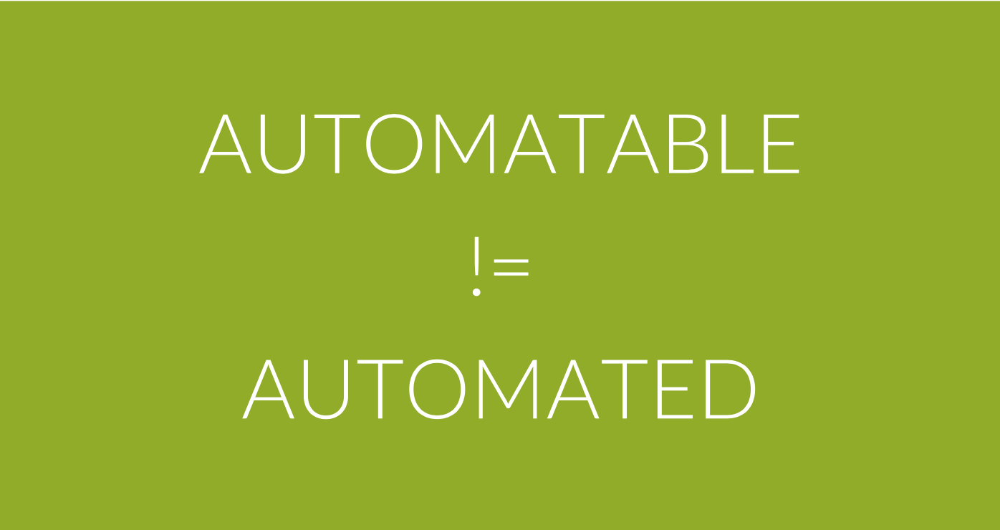
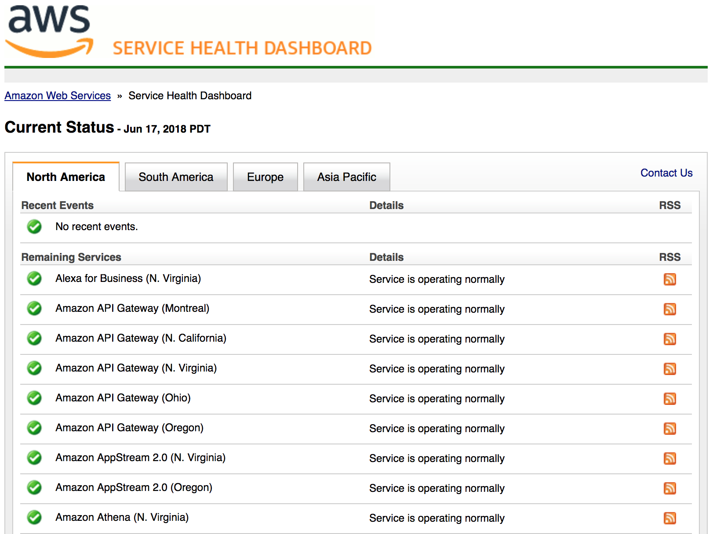
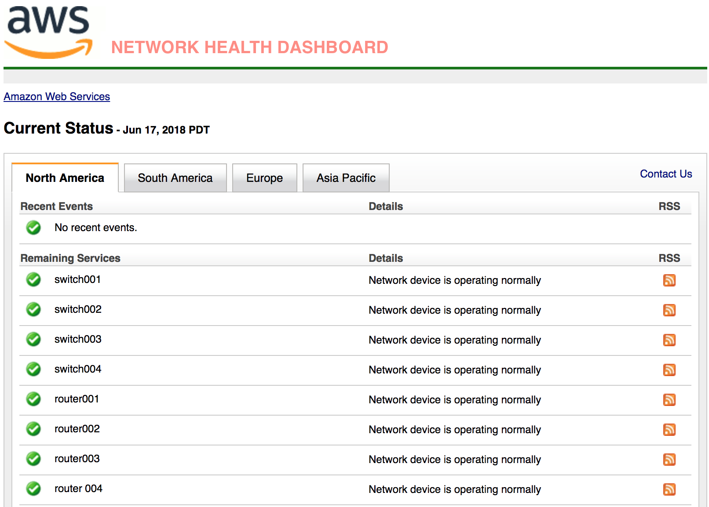
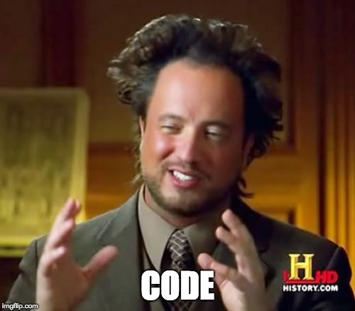
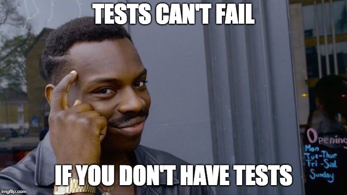
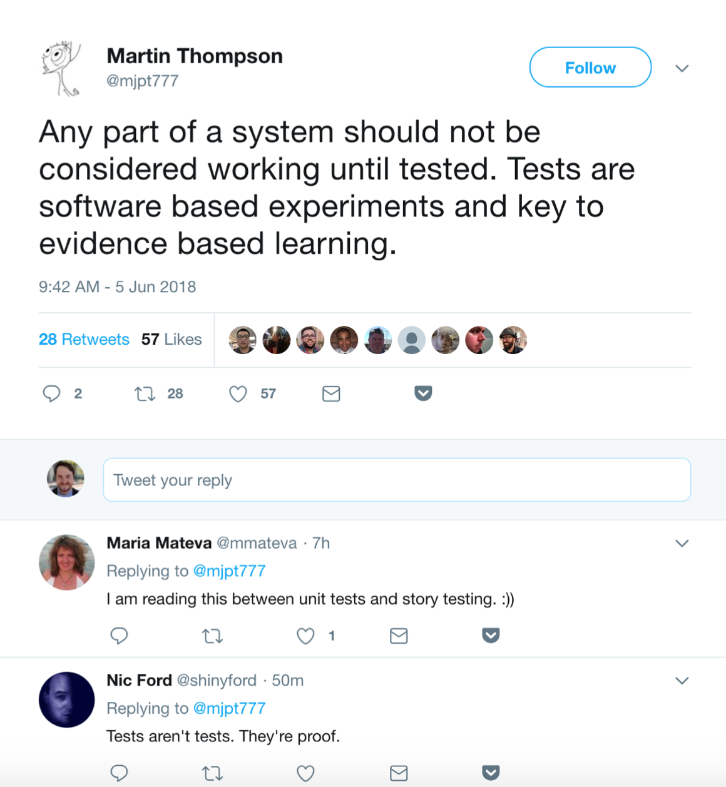
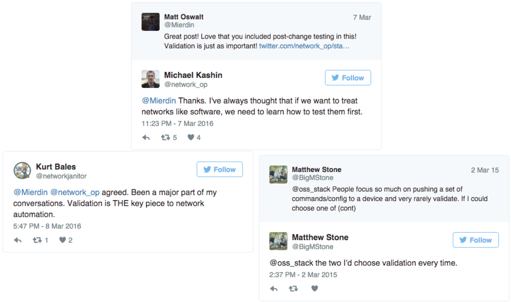

# Network Reliability Engineering
### Automation's North Star

---

## Heinous Automation Lies

---

---

---

---

---

---

---

### Automation is Just Operations in Machine Form

---

## Enter: Network Reliability Engineering

<!-- What's in a name? (below, old title) -->

---?image=images/devopssre.png&size=auto 90%

<!-- You might be wondering - what is NRE all about? Why does networking need its own thing?

Easy answer - it doesn't.

If you read up on SRE you'll find that it isn't actually separate from DevOps either. Where DevOps is a set of principles, an SRE is a **specific role** and set of skills that align with those principles. You might say SRE is simply an implementation of DevOps.

In the same way, NRE is also an implementation of DevOps. An NRE's job role and day-to-day reality is not the same as a "traditional SRE", so it's meaningful to have the role of NRE to aspire to, which implements the same back-end principles that SRE does. NRE is not meant to put up more silo walls - it is an extremely tangible path for traditional Network Engineers to adopt DevOps practices.

SRE is about ops and dev working together to take joint responsibility of the systems they operate.

For NRE, the dynamic is the same, but simply with different roles. An NRE's customer is often the SRE, and/or perhaps developers.

It's all about applying software practices and tools into operations. We've been talking about doing this for a long time - NRE gives this effort a name.

 -->

---?image=images/fire.png&size=auto 90%

---

# NRE Principles

- Composition
- Outcomes
- Tradeoffs
- Blameless Post-mortems

---

### The Seven Stages of Vendor Acceptance

1. I hear you
2. I see your point
3. I understand what you're saying
4. No one has asked for that before
5. I'll see what we can do
6. I'll get back to you
7. It's on the roadmap

(Credit to @ioshints for this genius)

---

---

---

## Composition: The "Automation Last Mile"

- Not automating everything, but always a day 2 gap
- Composition takes two forms
- AWS knows what they're doing

<!-- This is where automation plays a deep role in the NRE story. Not automating everything - automating what it takes to fill that 20% gap in service of the mission. -->

<!-- SDN "automates" stitching overlays between hypervisors
Kubernetes "automates" deploying applications
There's still always a gap between systems in Day 2.
Composition.

Composition takes two forms. Sure, NREs need to be able to write some code, or playbooks, or whatever. But that's not enough - learning Python to write some scripts is just a higher abstraction than a lower level programming language like C. You still need to write it yourself, and having ONLY these kind of skills, you're gonna come down with a severe case of "not invented here" syndrome pretty quick. So you also need to have a repertoire of purpose-built tools that follow the unix philosophy of doing one thing and doing it well, and having open interfaces so you can stitch them together.

Simple matter of programming

This is a big reason AWS is so attractive for app developers - not just because cloud is fashionable, or because of cost, but because amazon offers a slew of services at varying abstraction levels, where devs don't have to re-invent the wheel, they can stitch services together to make their "app". Same reason kubernetes has taken off. Write your app in a single-node context, take advantage of k8s constructs for scale, deployment, etc.

Actually building something yourself is a GREAT learning experience -->

---

## Outcomes

> What is the ultimate desired outcome for my work?

---

---

<!-- I've been a network engineer, and even I don't care about this. Can you imagine how little non-networkers care about this info? Yet for most network engineers this is how we still mostly talk about the health of the network. -->

---

## Tradeoffs

- Don't try to go for 100% uptime (error budgets)
- Don't try to automate everything
- Buy/assemble where you can, build when you must

<!-- IMO this is where the real engineering is. -->

---

## Blameless Post-mortems

> Failure is okay. Repeated failure is not.

<!-- Use an incident as a learning experience. The goal is to be able to modify your systems so that the issue doesn't happen again.

Blameless != accountabilityless
-->

---

## NRE Principles

- **Composition** - 80/20 rule
- **Outcomes** - service health is what matters
- **Tradeoffs** - Make decisions for the greater good
- **Blameless Post-Mortems** - Always be moving forward

<!-- Don't try to automate everything and don't strive for 100% uptime. Talk about error budgets. -->

---

## NRE Recipes

- Infrastructure as Code
- Automated Testing
- Event-Driven Automation

---

## Infrastructure as Code

---

> (Treat your) Infrastructure as (if it was) Code

---

## Automated Testing

---

---

---

## Automated Testing

- Compliance Validation
- Safety net for changes
- "What if" analysis

---

## Event-Driven Infrastructure

---?image=images/edi.png&size=auto 90%

---

### Event-Driven Infrastructure

- Triage - Incident Prep
- Auto-remediation
- ChatOps

<!--

More integration of monitoring systems. Specifically into EDI. And EDI needs more than just network events. So this breaks down silos.

Automation "as a platform". Automation with network knowledge "baked in" so that non networkers can just feed in parameters.

Not just maintaining a bunch of scripts, but developing them to fit into an automation framework like StackStorm. Just build focused Actions, and use the platform to stitch them together.

-->

---?image=images/book.png&size=auto 90%

<!-- 
Some orgs take folks from dev and press them into ops, others take ops and press them into more dev stuff.

SRE Skills:
- Coding
- Understanding systems (linux)
- Architecture (composition)
- Operational awareness - troubleshooting, debugging, risk understanding
- Networking
 -->

